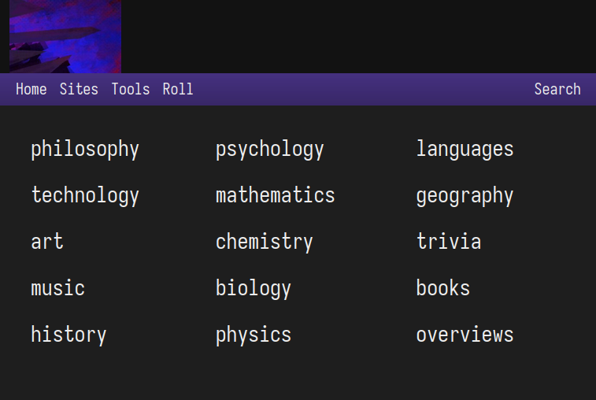

# My Personal Wikipedia

I created this website to keep my notes about certain topics book etc.
It's a bare minimum with a single entry to show how it should look
not exactly the way in which I take my notes but not far from it.

Since learning is a constant process I don't try to make these perfect,
I rely on the fact I will be updating them as I use them.
I also think notes are very personal shortcuts to concepts that shouldn't be shared
because of the confusion and errors they might cause.

## Reusability

The use of variables makes the website very easy to edit
both visually and functionally and the documentation makes it
simple to understand my design preferences.

